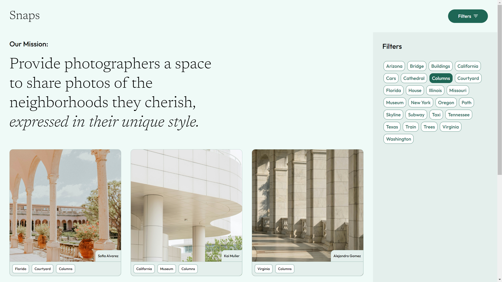

# Snaps

Snaps is a dynamic photo-sharing platform designed for viewing and sharing photos. Built with React and Typescript, this project allows users to interact with photos through viewing, sorting and commenting in an elegant interface.

## Features

🖼️ View and browse shared photos

💬 Comment and interact with posts

🎨 Responsive and visually appealing UI

## Tech Stack

Frontend: React, TypeScript, SCSS

Backend: Node.js, Express

## Screenshots

## Demo

